# Advanced Lane Line Finding

The goals / steps of this project are the following:

* Compute the camera calibration matrix and distortion coefficients given a set of chessboard images
* Apply a distortion correction to raw images
* Use color transforms, gradients, etc., to create a thresholded binary image
* Apply a perspective transform to rectify binary image ("birds-eye view")
* Detect lane pixels and fit to find the lane boundary
* Determine the curvature of the lane and vehicle position with respect to center
* Warp the detected lane boundaries back onto the original image
* Output visual display of the lane boundaries and numerical estimation of lane curvature and vehicle position

## Camera Calibration
For the camera calibration, it is necessary to provide some known images in order to calculate the calibration parameters. It is usually used chessboard images, because its corner are easily identified.

Bellow is presented the chessboard images used and its corner identified:

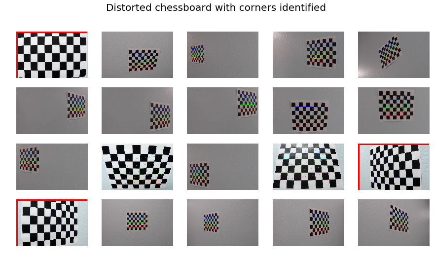

It is also important to notice that in the images with the red border it is not possible to identify the corners because part of the chessboard is out of the image.

After that, the parameters are collected and these parameters are used to correct any other image taken with the same lenses.

Bellow is presented the same chessboard images undistorted:

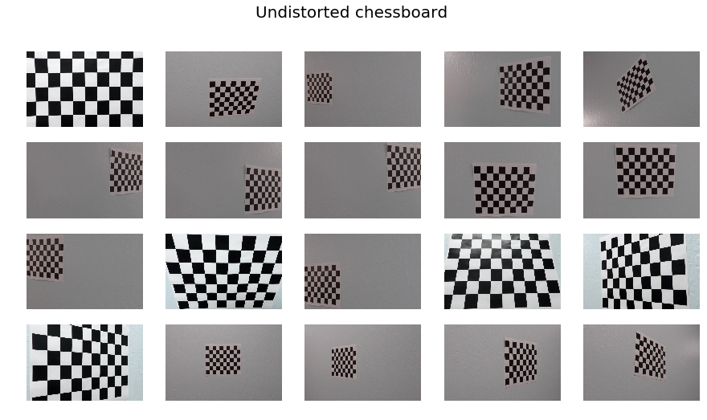

And also some road example images:

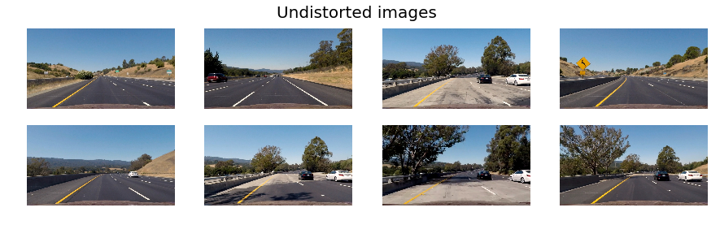

## Image Processing
To correctly identify the lanes, the input image needs to be processed in order to isolate the yellow and white lane.

Here different processing algorithm are used, and I will show the result of each one bellow.

### Sobel Threshold

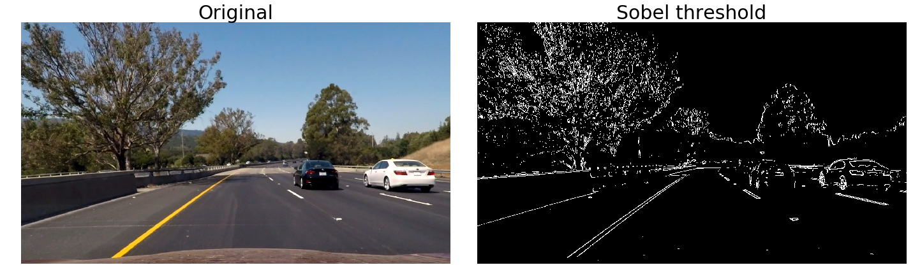

### Direction Threshold

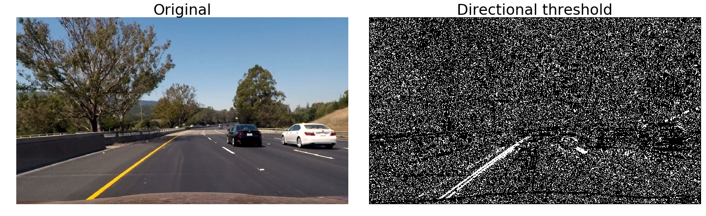

Observation: This direction threshold is implemented, however, it is not being used because it did not present any result improvement.

### Magnitude Threshold

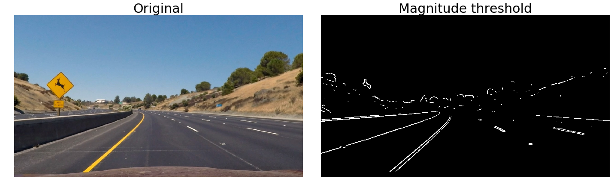

### Color Threshold
For the color threshold the image is firstly converted to HLS where the L and S channel are used to filter the yellow and white lanes.

Also, I decided to filter the yellow line from a specific range from the HLS and the white lane from the RGB image.

At the end, all the filters are combined together, and the output is presented bellow:

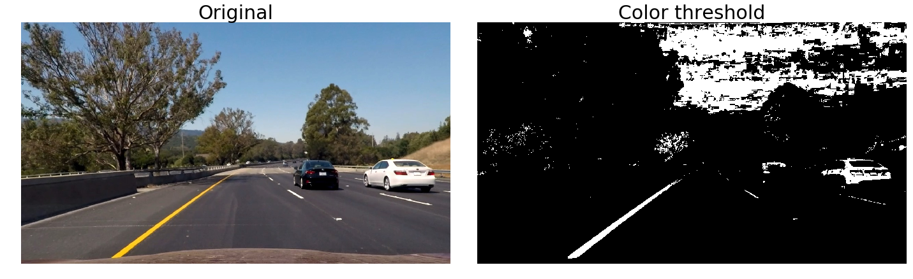

### Threshold Combined
Here is presented all the threshold presented above combined in the same image. It is noticed now how the lines can be easily identified.

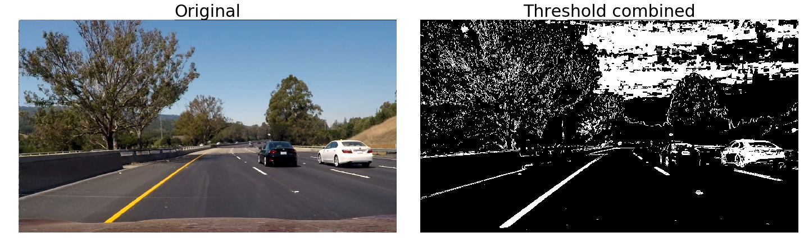

### Warp Image
Here the bird-eye view is applied, result an image as viewed from the top. It is really useful, because the lines are presented as parallel.

In the pipeline, it is done after the threshold, so, the output is a binary image instead of a color one.

### Identify Polynomial lines
Here is presented how the lanes are recognized, the green boxes are used to help finding the next chunk of pixels belonging to the lanes.

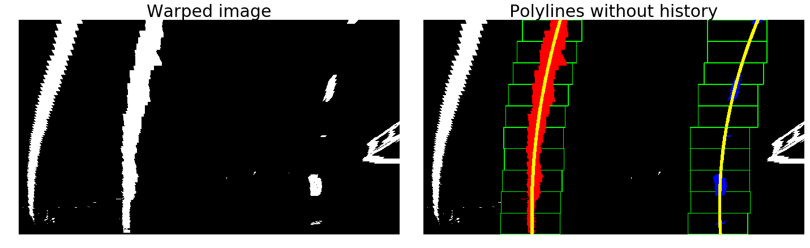

Once the lane position of the last frame is known, it searches for the lane 
within a margin from the last polynomial lane.

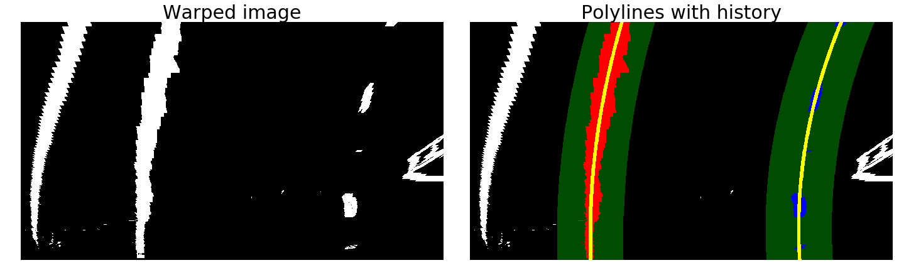

### Build Image
After identifying the lanes, it is necessary to plot it on the image, and this is the final result.

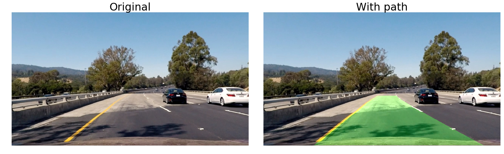

## Pipeline
Bellow is presented the pipeline in order to have the lanes correctly identified.

1. Convert image from BGR to RGB
2. Undistorted image
3. Apply threshold
4. Combine threshold
5. Warp image
6. Get polynomial
7. Get curvature and lane offset
8. Sanity check
	1. Check if lines did not converge to the same point
	2. Check if radius are similar
	3. Check if polynomials do not intersect each other
	4. Check if distance on top and bottom of image are similar
	5. Check if difference between current and last lane identified
9. Average lane position
10. Draw lines on image

## Results
The task of adjusting the parameters, in order to get a satisfactory result is really difficult. However a good result was obtained using this pipeline and parameters.

Bellow is presented a video containing the output result for the given video.

## Discussion
This algorithm was tested in two more videos, however the result is not as robust as the one presented above, and it fail in some frames.

For the challenge video, the bird's-eye view does not look nice as the one here presented and the distant lanes are not sharp, causing the algorithm to fail sometimes in recognizing it.

Also, it would be necessary to find a way to better tune the parameters, not manually, because even if I do the best I can tuning it, it will fail if tested in different conditions, such as in snow, rain and at night.

## Future Development
For future development, I would better tune the parameters in order to make it more robust and capable of recognizing the lane lines in different videos, such as the challenge videos.